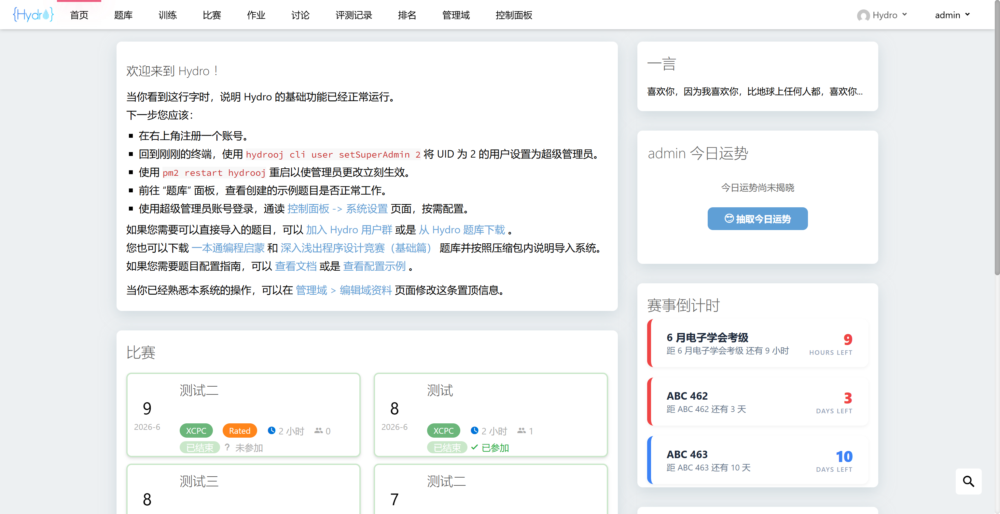

# Hydro 签到插件

兼容 V5.0.1 社区版，不依赖任何插件和第三方库，安装方法见官方文档。在安装了 `hydro-coin` 插件的情况下，会随机掉落 $1\sim 3$ 枚金币。

整体样式仿照洛谷打卡样式，在主运势下方随机产生两个宜事项和忌事项，以气泡形式出现详细解释。这里的事项是写在 `index.ts` 文件中的，不支持在线配置，如果要修改，确保每个事项是用 `.` 分开的两部分，前面部分是事项内容，后面部分是气泡解释内容。允许的配置项是主运势的描述，以及主运势配色，由于在 `index.ts` 中写了随机 $0\sim 6$ 的主运势，因此务必配置 7 项。

打卡签到会随机掉落 $1\sim 3$ 枚金币，安装了 `hydro-coin` 插件的情况下可以查看金币账单与商城。

`/img` 中是 `README.md` 的截图，安装时可以放心删除。

## 配置方法

```bash
# 在系统设置中 hydrooj.homepage 中适当的位置添加配置，示例如下
- width: 4          # 配置在右侧边栏，默认宽度为 3，建议调整为 4 会比较美观
  checkin:
    type:           # 配置主运势描述和配色
      - text: "AK IOI"
        color: "#ED5A65"
      - text: "AK APIO"
        color: "#ED5A65"
      - text: "AK NOI"
        color: "#ED5A65"
      - text: "AK NOIP"
        color: "#161823"
      - text: "AK CSP-S"
        color: "#161823"
      - text: "AK CSP-J"
        color: "#161823"
      - text: "登顶 GESP"
        color: "#161823"
```

## 数据表

所有信息存储在全局表 `checkin` 中，不会向任何原生数据表添加字段，便于迁移。如果你目前使用的签到插件是 [`checkin-33oj`](https://github.com/open33oj/hydro-plugins) 而不是 [`OI33`](https://github.com/open33oj/OI33)，那么 `hydro-checkin` 插件将支持首次启动时进行数据迁移。至于之前向 `user` 表中添加的字段如何删除，参考 [`OI33`](https://github.com/open33oj/OI33) 迁移说明。

|字段|类型|说明|
|:-:|:-:|:-|
|`uid`|`number`|签到者 ID|
|`date`|`string`|YYYY-MM-DD 格式的北京时间|
|`count`|`number`|连续签到次数|
|`total`|`number`|总计签到次数|
|`type`|`number`|最新一次签到主运势 $0\sim 6$|
|`content`|`string[]`|随机产生的四个事项，前两个是宜，后两个是忌|

## 部分截图



